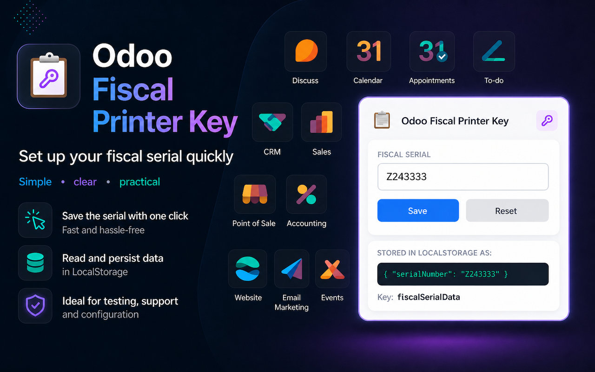

#  Odoo Fiscal Printer Key



A Chrome extension that stores a fiscal printer serial number and writes it to
`localStorage` on Odoo pages so the Odoo POS / fiscal module can read it.

> Independent third-party tool. Not affiliated with, sponsored by, or endorsed by Odoo S.A.

## What it does

- Stores a configurable serial number (default: `Z243333`).
- On every page load under `odoo.com` and `*.odoo.com`, writes the value to that page's `localStorage`:
    - **Key:** `fiscalSerialData`
    - **Value:** `{"serialNumber": "Z243333"}` (or whatever you have set)
- Provides a popup UI to view, edit, and reset the serial number.

## How the Odoo page reads it

```javascript
const raw = localStorage.getItem('fiscalSerialData');
if (raw) {
    const {serialNumber} = JSON.parse(raw);
    // use serialNumber...
}
```

## Installation

Install from the Chrome Web Store: _link will be added once the listing is published_.

## Editing the serial number

1. Click the extension icon in the toolbar.
2. Modify the **Serial Number** field.
3. Click **Save**.
4. Refresh the Odoo tab — the new value will be present in `localStorage`.

## Privacy

The extension stores the serial number locally via `chrome.storage.local`. Nothing is sent to any server. The serial is
only written into the `localStorage` of pages on `odoo.com` and its subdomains.

## Files

- `manifest.json` — extension config (Manifest V3)
- `background.js` — service worker; sets the default value on first install
- `content.js` — runs on Odoo pages; writes to `localStorage`
- `popup.html` / `popup.css` / `popup.js` — the popup UI
- `icons/` — extension icons (16, 48, 128 px)

## Notes

- The content script runs at `document_start`, so the value is in `localStorage` before page scripts run.
- If a page clears `localStorage`, the value is re-written on the next page load (or on any popup edit).
- Host scope is restricted to `*://odoo.com/*`, `*://*.odoo.com/*`,`*://odoo.dev/*` and `*://*.odoo.dev/*`.

## License

MIT
